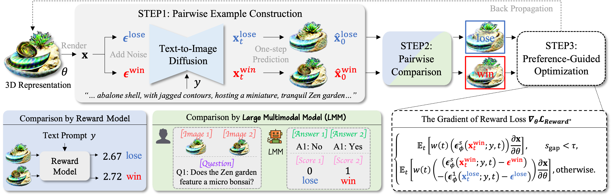

<div align="center">
<h1>DreamDPO: Aligning Text-to-3D Generation with Human Preferences via Direct Preference Optimization</h1>

[**Zhenglin Zhou**](https://scholar.google.com/citations?user=6v7tOfEAAAAJ) · [**Xiaobo Xia<sup>*</sup>**](https://xiaoboxia.github.io/) · [**Fan Ma**](https://flowerfan.site/) · [**Hehe Fan**](https://hehefan.github.io/) · [**Yi Yang<sup>*</sup>**](https://scholar.google.com/citations?user=RMSuNFwAAAAJ) · [**Tat-Seng Chua**](https://www.chuatatseng.com/) 

<a href='https://zhenglinzhou.github.io/DreamDPO-ProjectPage/'></a>
<a href='https://arxiv.org/abs/2502.04370'></a>

</div>

<p align="center">

</p>
DreamDPO is an optimization-based framework that integrates human preferences into the 3D generation process, through direct preference optimization. 
Practically, DreamDPO first constructs pairwise examples, then compare their alignment with human preferences using reward or large multimodal models, and lastly optimizes the 3D representation with a preference-driven loss function. 
By leveraging pairwise comparison to reflect preferences, DreamDPO reduces reliance on precise pointwise quality evaluations while enabling fine-grained controllability through preference-guided optimization.


## Citation
If you find DreamDPO useful for your research and applications, please cite us using this BibTeX:
```bibtex
@article{zhou2025dreamdpo,
      title={DreamDPO: Aligning Text-to-3D Generation with Human Preferences via Direct Preference Optimization}, 
      author={Zhenglin Zhou and Xiaobo Xia and Fan Ma and Hehe Fan and Yi Yang and Tat-Seng Chua},
      journal={arXiv preprint arxiv:2502.04370},
      year={2025},
}
```